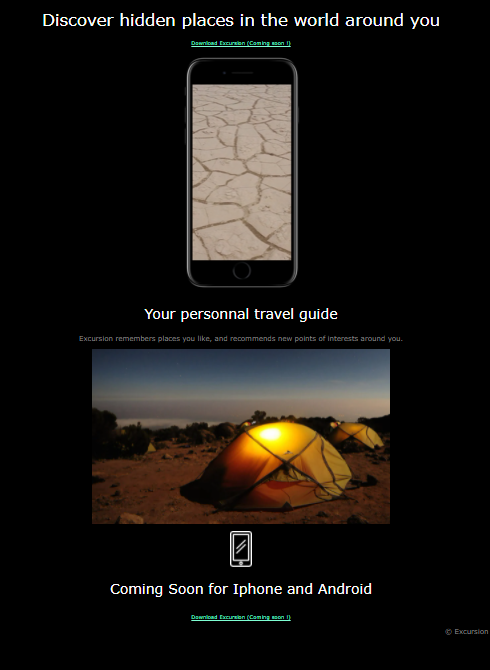

# DISCOVER HIDDEN PLACES IN THE WORLD AROUND YOU

A Codecademy's project.

## DESCRIPTION

I had a redline in order to produce this page.
You can see below the redline and the final project.

  <kbd>
    
  </kbd>

  <kbd>
    
  </kbd>

## Built With

*Visual Studio Code
 
*HTML
 
*CSS
 
*Markdown

## Author

Graffin Cindy 
 
graffincindy@gmail.com
